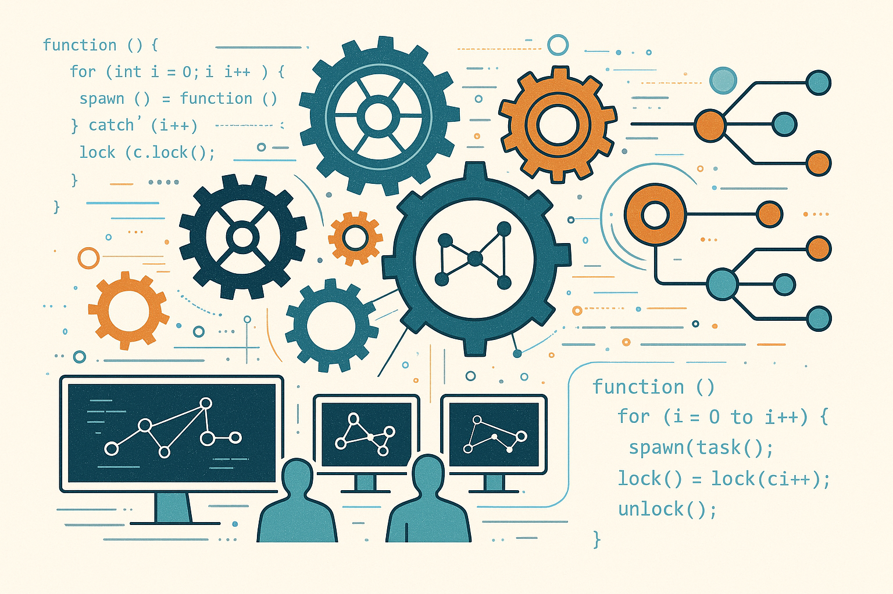

# 🧵 Programação Concorrente

Um repositório para armazenar e compartilhar minhas atividades na disciplina de Programação Concorrente.

## 📚 Tabela de Conteúdos

- [🧵 Programação Concorrente](#-programação-concorrente)
  - [📚 Tabela de Conteúdos](#-tabela-de-conteúdos)
  - [📋 Descrição](#-descrição)
    - [🚀 Funcionalidades](#-funcionalidades)
    - [📸 Prévia](#-prévia)
  - [⚙️ Construção](#️-construção)
    - [💻 Tecnologias](#-tecnologias)
    - [🛠️ Ferramentas](#️-ferramentas)
    - [📌 Versão](#-versão)
  - [✏️ Aprendizado](#️-aprendizado)
  - [✒️ Autores](#️-autores)
  - [🎁 Agradecimentos](#-agradecimentos)
  - [📨 Contato](#-contato)

## 📋 Descrição

Este é um repositório para armazenar e compartilhar minhas atividades na disciplina de Programação Concorrente, ministrada no curso de Ciência da Computação da UFRJ e tem como objetivo explorar conceitos de programação concorrente e paralela, desenvolver projetos que utilizam múltiplas threads, resolver problemas clássicos de sincronização e explorar conceitos como threads, mutexes, semáforos, monitores e programação paralela.

### 🚀 Funcionalidades

As funcionalidades disponíveis estão listadas abaixo:

- Implementação de conceitos de programação concorrente e paralela
- Desenvolvimento de aplicações multi-threaded
- Resolução de problemas clássicos de sincronização (produtor-consumidor, filósofos, etc.)
- Exploração de mecanismos de sincronização (mutex, semáforos, monitores)
- Análise de performance e otimização de código paralelo

### 📸 Prévia

  

## ⚙️ Construção

Resumo geral dos recursos utilizados na construção do projeto.

### 💻 Tecnologias

Tecnologias utilizadas na construção do repositório:

### 🛠️ Ferramentas

Ferramentas utilizadas na construção do repositório:

### 📌 Versão

Utilizei o Git para o controle de versão.

Versão atual: 1.0 (primeira versão)

## ✏️ Aprendizado

Ao construir esse repositório, aprendi a:

- Criar e gerenciar threads em diferentes linguagens de programação
- Implementar mecanismos de sincronização (mutex, semáforos, monitores)
- Resolver problemas clássicos de concorrência
- Analisar e otimizar código paralelo
- Entender os desafios da programação concorrente (deadlock, race conditions, starvation)

## ✒️ Autores

* **Milton Salgado Leandro** - *Todo o Repositório* - [GitHub](https://github.com/milton-salgado)

## 🎁 Agradecimentos

* Agradeço à professora da disciplina, Silvana Roseto e aos monitores pelo auxílio no meu processo de aprendizagem e apoio na construção do repositório.
* Agradeço também a você, visitante, por visualizar o meu repositório!

## 📨 Contato

